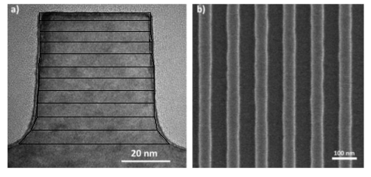
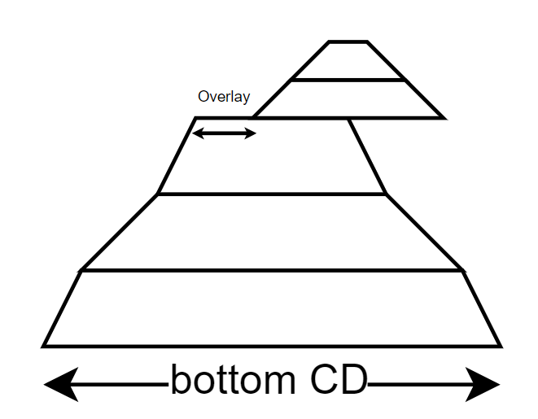

# Overview

Miniaturizing transistors, the building blocks of integrated circuits, presents significant challenges for the semiconductor industry. Precisely measuring these features during production is crucial for high-quality chips. Existing in-line metrology techniques, such as optical critical-dimension (OCD) scatterometry and critical-dimension scanning electron microscopy (CD-SEM), are nearing their limits. OCD struggles with the inherent limitations of light and shrinking features, while CD-SEM, despite providing valuable insights, is restricted by sampling area and resolution. To overcome these obstacles, the industry is exploring X-ray-based metrology. X-rays, with their shorter wavelengths, allow for more precise analysis and are sensitive to variations in composition, providing richer data.

CD-SAXS (Critical Dimension Small Angle X-ray Scattering) is a promising technique for nanostructure electronics. It uses a transmission geometry, sending the beam through the sample and the 750 micrometer-thick silicon wafer. The x-ray spot size varies between 10-1000 μm, enabling the measurement of small patterned areas. Studies have shown CD-SAXS's effectiveness in characterizing the shape and spacing of nanometer-sized patterns.

Although several big companies are developing software for CD-SAXS, this technique is still in its infancy and there isn't an open source coherent package available for its data analysis. Thus, this `cdsaxs` package is aimed at providing simulation and fitting tools for CD-SAXS synchotron data for researchers.

# Simulation models

For the moment we have two kinds of most commonly used samples in the industry. The first one is a cross section of a line in a line/space pattern. Here the cross section of line is modeled by a stack of trapezoids that together form the shape of the cross section as shown in figure below. Thus it is named Stacked trapezoid model.

|  |
|:--:|
| *Image in a) is a cross-section of a) line in b). The black trapezoidal shapes represent the modelling done for this simulation.* |

The second model is similar in concept but with another nano-structure on top of it as shown in figure below. It is called the Strong Castle Model. It is very useful to model the overlay of two structures. 
    
||
|:--:|
| *Strong castle model where top structure is not aligned thus we have an overlay.* |

To obtain the Intensity map of the scattering pattern, we do the fourier transformation of each individual trapezoid and then sum them up. The fourier transformation of a trapezoid is given by the following equation:

\begin{equation}
    F\left(q_{x}, q_{z}\right) = \frac{1}{q_{x}}\left[
    -\frac{m_{1}}{t_{1}} e^{-i q_{x}\left(\frac{\omega_{0}}{2}\right)}\left(1 - e^{-i h\left(\frac{q_{x}}{m_{1}} + q_{z}\right)}\right)
    + \frac{m_{2}}{t_{2}} e^{-i q_{x}\left(\frac{\omega_{0}}{2}\right)}\left(1 - e^{-i h\left(\frac{q_{x}}{m_{2}} + q_{z}\right)}\right)
    \right]
    \label{eq:trapezoidal_ft}
\end{equation}

where,

\[
\begin{array}{l}
\mathrm{m}_{1} = \tan\left(\beta_{1}\right) \\
m_{2} = \tan\left(\pi - \beta_{r}\right) \\
t_{1} = q_{x} + m_{1} q_{z} \\
t_{2} = q_{x} + m_{2} q_{z}
\end{array}
\]

