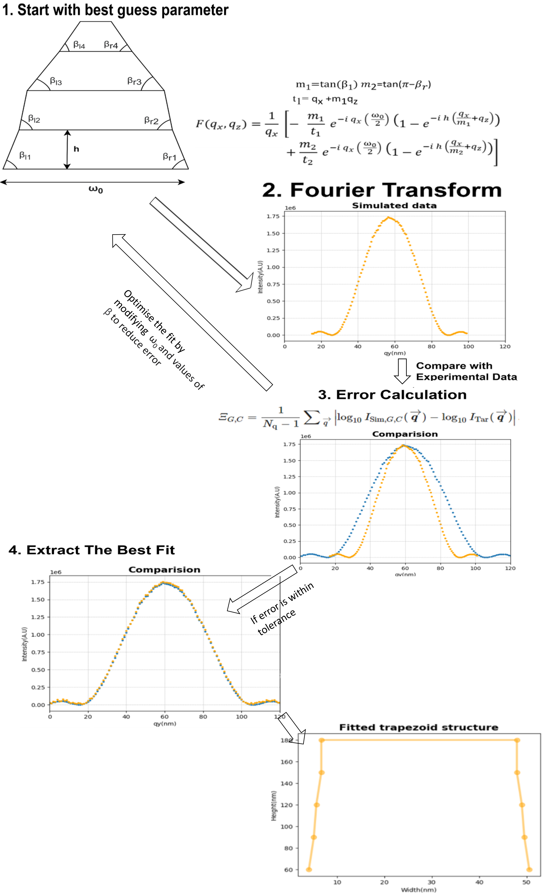
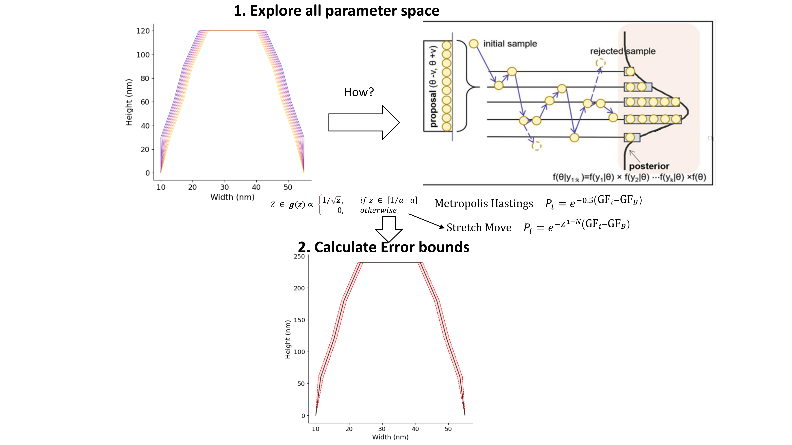
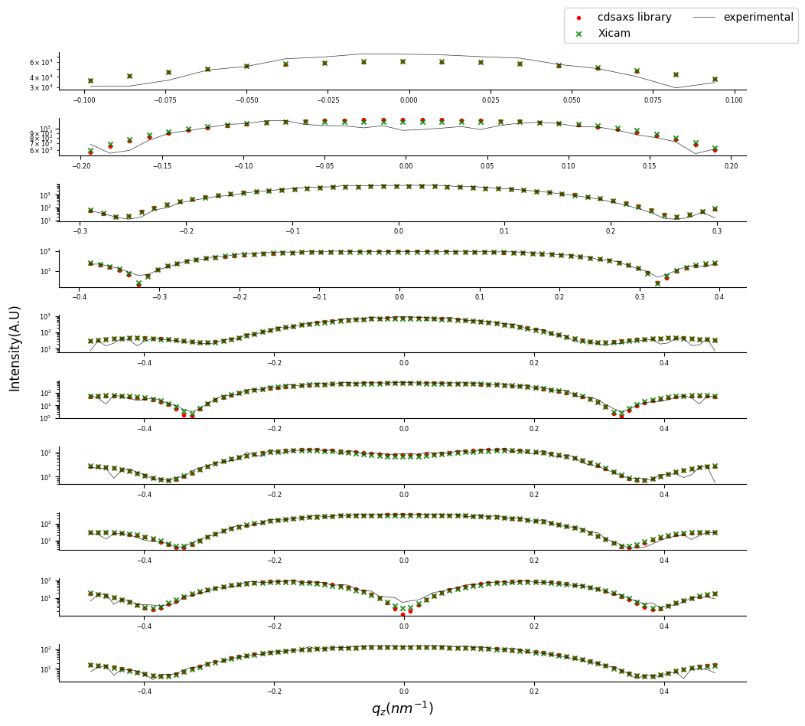
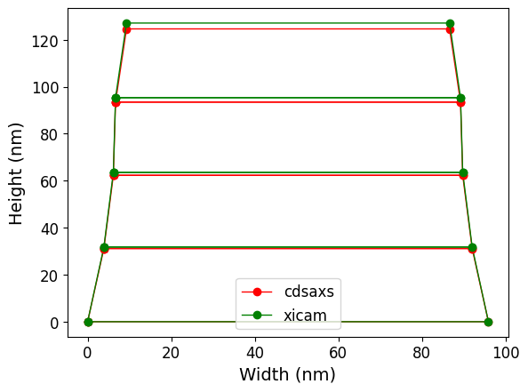
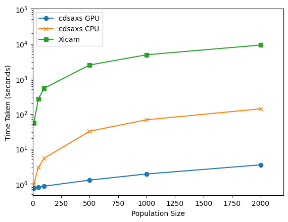

# Summary

Miniaturizing transistors, the fundamental components of integrated circuits, poses significant challenges for the semiconductor industry. Accurate measurements of these features during production **are** essential to ensure the creation of high-quality chips. However, conventional in-line metrology techniques are approaching their limits. To address these challenges, the industry is turning to advanced X-ray-based metrology [@sunday2015].

CD-SAXS (Critical Dimension Small Angle X-ray Scattering) is an emerging and promising technique in this field. Studies conducted by [@sunday2015] have demonstrated the effectiveness of CD-SAXS in accurately characterizing the shape and spacing of nanometer-scale patterns. The `cdsaxs` package is designed to offer comprehensive simulation and fitting tools for CD-SAXS synchrotron data, supporting researchers in advancing this innovative technology.

# Statement of need

CD-SAXS is a powerful and evolving technique for the characterization of nano-components in the semiconductor industry. Community efforts have explored different combinations of algorithms to model CD-SAXS data, as described by [@hannon2016advancing; @sunday2016mcmc]. However, there is a lack of open-source software for comprehensive data analysis. Xi-cam [@Xi-cam] is the only publicly available **Python** package that includes CD-SAXS data analysis, although the code is no longer maintained. While there are a few other proprietary **software packages**, they are not freely accessible to the community. Thus, developing models and analysis tools for CD-SAXS often requires researchers to create their own solutions for simulation and fitting. Moreover, the diversity of samples analyzed using CD-SAXS requires versatile software that can accommodate different types of models and experimental conditions.

The `cdsaxs` package is designed to address this critical gap by providing a modular, open-source solution tailored for CD-SAXS data analysis. It includes two robust models for simulating CD-SAXS data, while also allowing researchers to integrate their own models. This flexibility is crucial for testing and validating models against experimental data, making the development process more streamlined and accessible.

A key feature of this package is its separation of the simulation and fitting processes, enabling users to concentrate on model development and data analysis without being encumbered by technical complexities. The package is optimized for performance, with support for vectorized fitting on both CPUs and GPUs, significantly enhancing the speed and efficiency of data processing. The fitting process in `cdsaxs` is powered by the CMA-ES (Covariance Matrix Adaptation Evolution Strategy) algorithm, known for its rapid convergence in X-ray fitting [@hannon2016advancing]. This efficiency allows for real-time data fitting during experiments, empowering researchers to dynamically adjust experimental parameters based on immediate feedback from the analysis.

Additionally, the package incorporates uncertainty estimation in the fitted parameters using the MCMC (Markov Chain Monte Carlo) algorithm, providing researchers with more reliable and nuanced results [@sunday2016mcmc].

By aiming to fill the current void in CD-SAXS data analysis tools, `cdsaxs` seeks to accelerate research workflows and make advanced analytical techniques more accessible.

# Description

The `cdsaxs` package provides a comprehensive framework for analyzing CD-SAXS data, focusing on the systematic workflow of candidate generation, evaluation, and uncertainty estimation. It is also flexible enough to accommodate user-defined models, making it a versatile tool for researchers working with diverse nanostructures.

1. **Candidate Generation and Evaluation**:
    - The core of the `cdsaxs` fitting process begins with generating a series of candidate parameters. Each set of parameters represents a possible nanostructure configuration, defined by a set of features (e.g., widths, heights, etc.).
    - These candidate models are then transformed into reciprocal space through a **Fourier Transform**, allowing direct comparison with the experimental CD-SAXS data.
    - The package utilizes an optimization algorithm, specifically the Covariance Matrix Adaptation Evolution Strategy (CMA-ES), to iteratively refine the model parameters. This algorithm excels in high-dimensional optimization, rapidly converging on a solution that minimizes the error between the simulated and experimental scattering intensities.

2. **Simulation and Comparison**:
    - The simulation process can also function independently, generating CD-SAXS data based on user-defined parameters without the need for experimental data. This is particularly useful for testing and validating models in a controlled setting.
    - In addition to the two built-in models, users can define their own models, allowing for a wide range of nanostructure configurations to be tested.
    - When experimental data is available, the package simulates scattering profiles for each candidate model and calculates a goodness-of-fit metric by comparing the simulated data with the experimental measurements. The optimization algorithm adjusts the model parameters to minimize this metric, ensuring the best possible match.

3. **Uncertainty Estimation**:
    - After determining the best-fit model, `cdsaxs` employs a Markov Chain Monte Carlo (MCMC) algorithm to estimate the uncertainties associated with the model parameters. This step is crucial for understanding the robustness of the fit and identifying potential alternative structures that could produce similar scattering data.
    - The MCMC method generates a distribution of possible parameter sets, from which the package calculates confidence intervals, providing a quantitative measure of uncertainty for each parameter.

The following diagram illustrates the overall workflow of the CMA-ES algorithm in the `cdsaxs` package:

{width="100%"}

The overall workflow of the MCMC algorithm:

{width="100%"}

This workflow ensures that the `cdsaxs` package not only identifies the optimal model configuration but also quantifies confidence in the results, making it a powerful tool for CD-SAXS data analysis in both research and industrial applications.

# Comparison

Xi-cam [@Xi-cam] is the open-source software used for CD-SAXS simulations described by Choisnet et al. [@timothee]. Notably, they use a six-stacked trapezoid model and a rounded trapezoid model for the simulations. The experimental dataset used by Choisnet et al. in their study was also used here to test our model. We fitted the dataset with a six-stacked trapezoid model, enabling a direct comparison between Xi-cam and this package. The results are shown in the figure below:

{width="100%"}

{width="50%"}

Under the same initial conditions and search criteria, we demonstrate that the fits are remarkably similar, validating the accuracy of our modeling approach.

Using the same dataset, execution time was also measured. The number of generations was kept constant at 100, and different population sizes were tested. The tests were performed on an Ubuntu server with 64 logical processors (Intel® Xeon® Platinum 8362 CPU @ 2.80 GHz) and an NVIDIA A100 80GB PCIe GPU.

{width="100%"}

We observe that the `cdsaxs` package shows significant improvements in execution time (more than 10× for CPU execution and 100× for GPU execution) compared to the previous code.

# Conclusion

In this work, we presented the `cdsaxs` package, a comprehensive and modular open-source framework for CD-SAXS data analysis. By integrating CMA-ES for fast optimization and MCMC for robust uncertainty estimation, the package offers both speed and reliability for fitting synchrotron data. Benchmark comparisons demonstrate significant improvements over previous tools, both in accuracy and execution time. We believe `cdsaxs` will accelerate research workflows in the semiconductor industry and provide a foundation for future developments in X-ray-based metrology.

# Acknowledgements

This work, carried out on the Platform for Nanocharacterisation (PFNC), was supported by the “Recherche Technologique de Base” and "France 2030 - ANR-22-PEEL-0014" programs of the French National Research Agency (ANR).

# References
