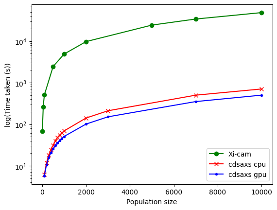

# Summary

Miniaturizing transistors, the fundamental components of integrated circuits, poses significant challenges for the semiconductor industry. Accurate measurement of these features during production is essential to ensure the creation of high-quality chips. However, conventional in-line metrology techniques are approaching their limitations. To address these challenges, the industry is turning to advanced X-ray-based metrology [@sunday_2015].

CD-SAXS (Critical Dimension Small Angle X-ray Scattering) is an emerging and promising technique in this field. Studies[@sunday_2015] have demonstrated the effectiveness of CD-SAXS in accurately characterizing the shape and spacing of nanometer-scale patterns. The cdsaxs package is designed to offer comprehensive simulation and fitting tools for CD-SAXS synchrotron data, supporting researchers in advancing this innovative technology.

# Statement of need

CD-SAXS is a powerful and developing technique for characterization of nano-components in semiconductor industry. Efforts by the community were done to explore different combination of algorithms to model CD-SAXS data [@hannon2016advancing, @sunday2016mcmc]. However, there is a lack of open-source software for comprehensive data analysis. **Xi-cam**[@Xi-cam] is the only publicly available python package that contains CD-SAXS data analysis but the code is no longer maintained. While there are few other proprietary softwares, it is not freely accessible to the community. Thus, development of model and it's analysis for CD-SAXS requires researchers to develop their own solutions for simulating and fitting. Moreover, the diversity of samples analyzed using CD-SAXS requires versatile software that can accommodate different types of models and experimental conditions.

The cdsaxs package is designed to address this critical gap by providing a modular, open-source solution tailored for CD-SAXS data analysis. It includes two robust models for simulating CD-SAXS data, while also allowing researchers to integrate their own models. This flexibility is crucial for testing and validating models against experimental data, making the development process more streamlined and accessible.

A key feature of this package is its separation of the simulation and fitting processes, enabling users to concentrate on model development and data analysis without being encumbered by technical complexities. The package is optimized for performance, with support for vectorised fitting on both CPUs and GPUs, significantly enhancing the speed and efficiency of data processing. The fitting process in cdsaxs is powered by the CMAES (Covariance Matrix Adaptation Evolutionary Strategy) algorithm, known for its rapid convergence for x-ray fitting[@hannon2016advancing]. This efficiency allows for real-time data fitting during experiments, empowering researchers to dynamically adjust experimental parameters based on immediate feedback from the analysis.

Additionally, it incorporates uncertainty estimation in the fitted parameters using the MCMC (Monte Carlo Markov Chain) inverse algorithm, providing researchers with more reliable and nuanced results[@sunday2016mcmc].

By aiming to fill the current void in CD-SAXS data analysis tools, cdsaxs targets to speed up research workflows and to make advanced analytical techniques more accessible.

# Description

The `cdsaxs` package provides a comprehensive framework for analyzing CD-SAXS data, focusing on the systematic workflow of candidate generation, evaluation, and uncertainty estimation. It is also flexible enough to accommodate user-defined models, making it a versatile tool for researchers working with diverse nanostructures.

1. **Candidate Generation and Evaluation**:
    - The core of the `cdsaxs` fitting process begins with generating a series of candidate parameters. Each set of parameters represents a possible nanostructure configuration, defined by a set of features(e.g., widths, heights etc).
    - These candidate models are then transformed into the reciprocal space through a Fourier Transform, allowing direct comparison with the experimental CD-SAXS data.
    - The package utilizes an optimization algorithm, specifically the Covariance Matrix Adaptation Evolutionary Strategy (CMAES), to iteratively refine the model parameters. This algorithm excels in high-dimensional optimization, rapidly converging on a solution that minimizes the error between the simulated and experimental scattering intensities.

2. **Simulation and Comparison**:
    - The simulation process can also function independently, generating CD-SAXS data based on user-defined parameters without the need for experimental data. This is particularly useful for testing and validating models in a controlled setting.
    - In addition to the two built in models, users can define their own models, allowing for a wide range of nanostructure configurations to be tested.
    - When experimental data is available, the package simulates scattering profiles for each candidate model and calculates a goodness-of-fit metric by comparing the simulated data with the experimental measurements. The optimization algorithm adjusts the model parameters to minimize this metric, ensuring the best possible match.

3. **Uncertainty Estimation**:
    - After determining the best-fit model, `cdsaxs` employs a Monte Carlo Markov Chain (MCMC) algorithm to estimate the uncertainties associated with the model parameters. This step is crucial for understanding the robustness of the fit and identifying potential alternative structures that could produce similar scattering data.
    - The MCMC method generates a distribution of possible parameter sets, from which the package calculates confidence intervals, providing a quantitative measure of uncertainty for each parameter.

Following diagram illustrates the overall workflow of the CMAES algorithm in the `cdsaxs` package:
 {width="100%"}

 And, the overall workflow of the MCMC algorithm:
 {width="100%"}

This workflow ensures that the `cdsaxs` package not only identifies the optimal model configuration but also quantifies the confidence in the results, making it a powerful tool for CD-SAXS data analysis in both research and industrial applications.

# Comparison

**Xi-cam**[@Xi-cam] is the open source software that was used for CD-SAXS simulations in this paper[@timothee]. Notably they use six stacked trapezoid model and rounded trapezoid model to do the simulation. The experimental dataset used by Choisnet et al. for their study was used here to test our model. We also fitted the dataset with with six stacked trapezoid model, enabling a direct comparison between Xi-cam and this package. The results are shown in the figure below:

{width="100%"}

For same initial conditions and search criteria, we were able to demonstrate that the fits are remarkably similar and therefore demonstrate the accuracy of our modeling.

Similarly, with the same dataset time taken to execute the program was measured. The number of generation was kept constant at 100 and different population sizes were tested. The test was performed on a ubuntu server with 164 logical processor of model Intel(R) Xeon(R) Platinum 8362 CPU @ 2.80GHz and the gpu used was NVIDIA A100 80GB PCIe.

{width="100%"}

We can observe that the cdsaxs package has significant improvement in execution time (almost five times) over old code.

# Acknowledgements

This work, carried out on the Platform for Nanocharacterisation (PFNC), was supported by the “Recherche Technologique de Base” and "France 2030 - ANR-22-PEEL-0014" programs of the French National Research Agency (ANR).

# References
